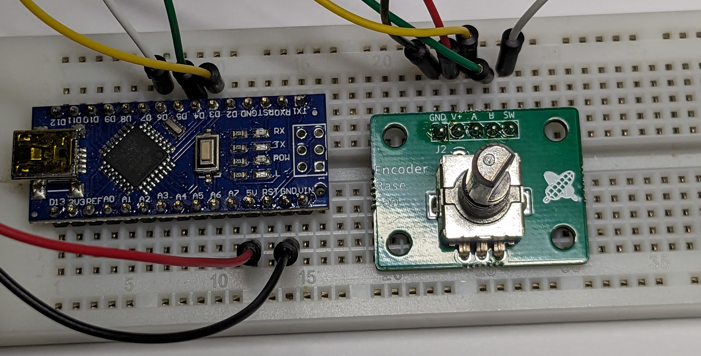

# Encoder Base San

[Document in Japanese](README_ja.md)
Encoder Base San is a utility PCB for using Rotary Encoder.
Dedicated to fit widely used 12mm size encoders such as Alps Alpine's EC12E2420801 and its compatibles.

It implements filter circuit shown on [ALPS ALPINE WEBSITE](https://tech.alpsalpine.com/e/products/detail/EC12E2420801/) and pull-up registor for switch output. Please see schematics for details.

## Kit Contents

- Circuit board
- 1x5 pin header
(Important: This kit does not include rotary encoder itself. Please use with you own rotary encoder).

## How to assemble

1. Solder pin header and rotary encoder.

## Application

1x5 area can solder other connectors, directions. For example you can use pin socket, solder pin header from top side, etc., according to your demand.

It has four screw holes. They can be used for fixing, for example, when strong force is applied.
