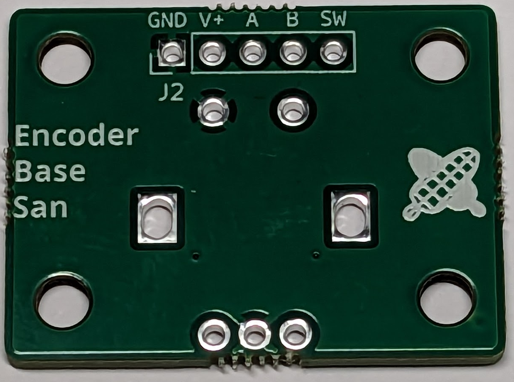
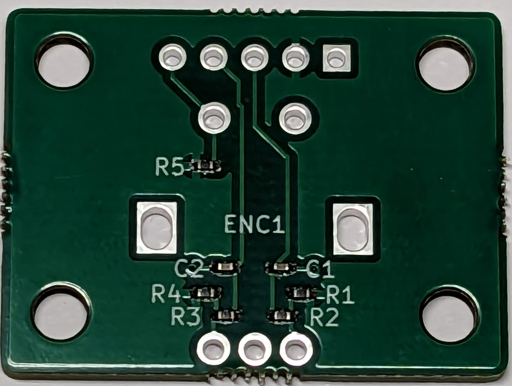

# エンコーダーベースさん

エンコーダーベースさんはロータリーエンコーダーを使う時に便利な基板です。アルプスアルパイン社の12型エンコーダ EC12E2420801 や、その互換品などに使用することができます。

この基板には[アルプスアルパイン社のウェブサイト](https://tech.alpsalpine.com/j/products/detail/EC12E2420801/)に掲載されている、推奨のフィルタ回路と、スイッチのためのプルアップ抵抗が実装されています。

## キットの内容

- 基板
- 1x5 ピンヘッダ
(注意: ロータリーエンコーダーは付属しません。必要に応じたものをご用意ください)

## 組み立て方

1. ピンヘッダとエンコーダーをはんだづけしてください。

## 応用

1x5の部分にピンソケットをつけたり、ピンヘッダを逆向きにはんだづけするなど、用途に応じてご利用ください。

ネジ穴が4ヶ所あります。力のかかる場合など、固定に使用することができます。
